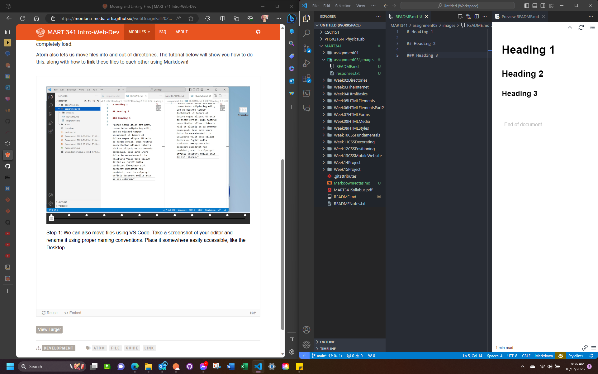

# Heading 1

## Heading 2

### Heading 3

----------------------------
# Links

[Wizards of the Coast](https://company.wizards.com/en)

[My File](./responses.txt)

***Note:***
When files are at the same level (indentation) of a directory, their URLs follow the template: 

`./filename.filetype`

The above is a *relative URL*, which effectively translates to: `start here (.) and select (/) the file (responses.txt).`

----------------------------
# Linking Images

When files are at a deeper level of a directory,, their URLs follow the template: `./folder/filename.filetype`

The above added the `images` subdirectory to the link path, stating `./images/screenshot.png` as the *relative URL*; effectively, this translates to `start here (.), go inside (/) the folder (images), select (/) the file (screenshot.png)`.